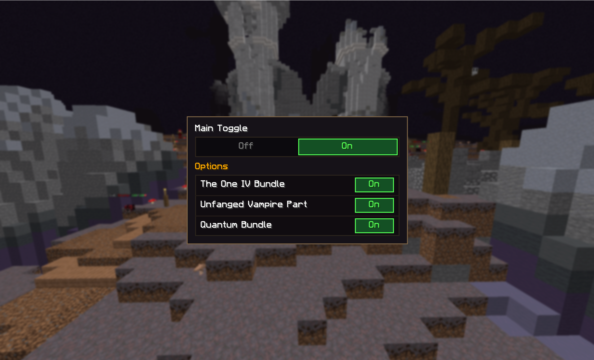
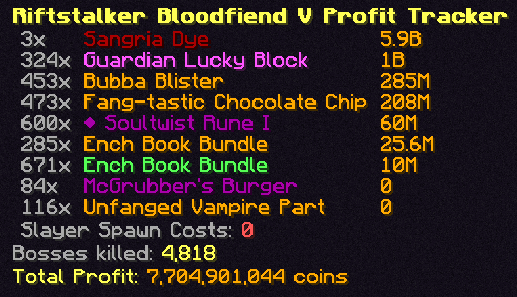
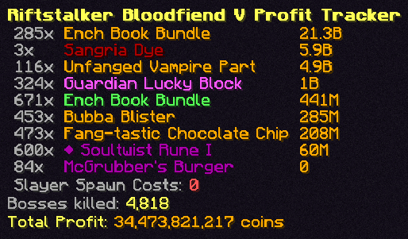

# shpricefix

Fix SkyHanni's profit tracker showing the old npc sell price (?) for the one & quantum bundle, and 0 for unfanged parts.

**Bundles**: uses bz price based off your skyhanni settings (buy order/instasell)

**Fang**: uses lbin data for dentist relic

> Requires SkyHanni, tested & works on version 9.1.0 (MC 26.1)

## Usage

`/pricefix` to open gui:

## Example

<table>
  <tr>
    <td align="center"><b>Before</b></td>
    <td align="center"><b>After</b></td>
  </tr>
  <tr>
    <td align="center"></td>
    <td align="center"></td>
  </tr>
</table>

## Todo
Test on other mc & sh versions